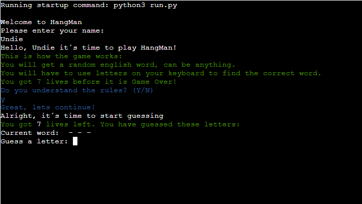
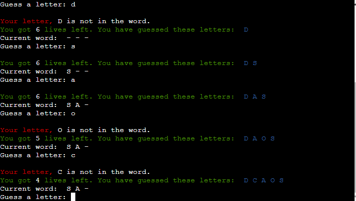
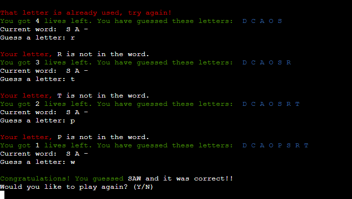
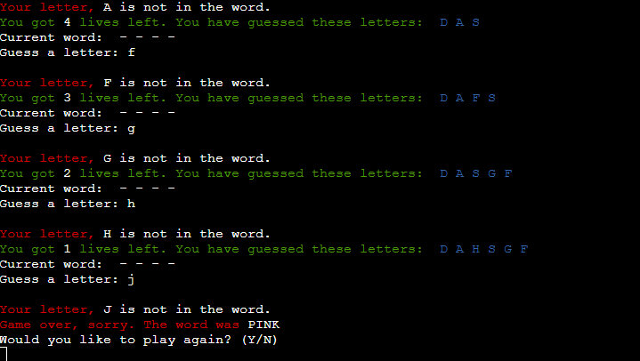

# HangMan Game
HangMan Game is a python terminal game, which is deployed on Code Institute's mock terminal on Heroku

Users who wants to play the HangMan Game can challenge themselves in guessing the correct word, which is
chosen randomly from an array of english words.

[You can find the live project here](https://hangman-undie.herokuapp.com/)

[Repository can be found here](https://github.com/Undie92/hang-man)

## How to play the game
HangMan is based on the paper-pen version, you can read more about it on [Wikipedia.](https://en.wikipedia.org/wiki/Hangman_(game))

When the user starts the game, they will be prompted to enter their username.

When the user has entered their username, they will recieve instructions on how the game works.

When the user has understood the instructions, and proceeds to continue, they will be given a secret word,
and the user will have 7 lives to guess the correct word.

When the user has guessed the wrong letter 7 times, the game will say "Game Over", and ask the user if they would like to play again.

When the user has guessed the correct word, the game will say "Congratulations", and ask the user if they would like to play again.

## Features

* Random secret word
  * The player is given a secret word to guess.
  * The player has 7 lives to get the word correct.

  * Remembers what letters you guess.
  * Counting lives remaining.
  * Shows what letters guessed is in the secret word.
  * Tells you if letter guessed is correct or not.

  * Congratulates you if you guessed the correct word.
  * Asks you if you want to play again.

  * Tells you Game Over if you failed all your lives.
  * Shows you the correct word.
  * Asks if you want to play again.

### Future Features
  * Allow player to change language and add words according to the language chosen.
  * Allow player to change difficulty, easy/medium/hard.
  * Display media when you hang the man with every wrong guess.

## Testing
I have manually tested this game by:

  * Passing the code through Code Institute Python Linter, PEP8 and passed without problems.
  * Incorrectly guess with special characters or numbers.
  * Correctly guess with letters.
  * Trying to input empty guess.

### Bugs
  * I did have some bugs when writing the code for this project, such as whitespaces, syntax errors and so on. 
  * I did correct it as i went by with the project, to get it working and to make it pass through PEP8 validator.
  * The finished deplyoed product, contains no known bugs as it is.

## Technologies Used
 ### Languages
  * [Python:](https://www.python.org/) Python was the language used to write the game.
  * [Markdown:](https://www.markdownguide.org/basic-syntax/) Markdown language was used to write the README.md.

### Environment
  * [GitHub:](https://github.com/) Hosted the code.
  * [GitPod:](https://www.gitpod.io/) Was used to write the code.
  * [Heroku:](https://id.heroku.com/login) Was the cloud hosting platform with the mock terminal for this project.

### Other
  * [Colorama:](https://pypi.org/project/colorama/) Was the module for coloring the text in console.

## Deployment
 This project was deployed using Code Institute's mock terminal for Heroku.

  * Steps for deplyoment:
    * Fork or clone this repository
    * Create a new Heroku account
    * Create a new Heroku app
    * Set the buildbacks to Python and NodeJS in that exact order
    * Link the Heroku app to Github and chose the correct repository
    * Click on Deploy

## Credits

  * Code Institute for the deployment terminal
  * [Youtube](https://www.youtube.com/watch?v=cJJTnI22IF8) - For inspiration and useful information  
